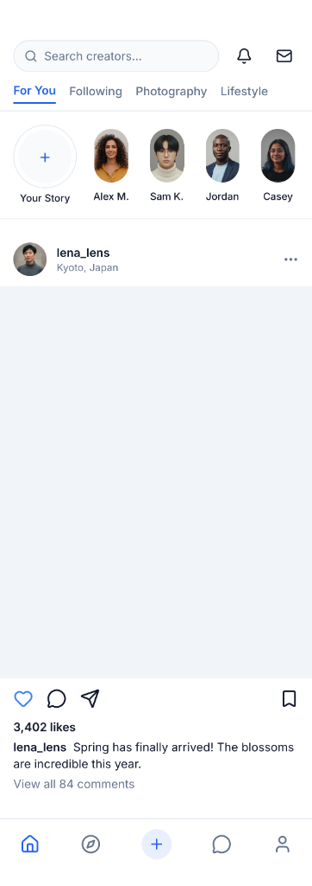
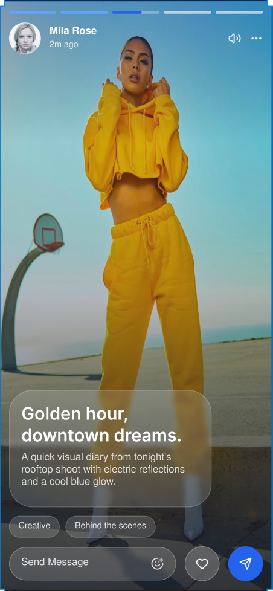

# 💓 Pulse Social

**Connect. Create. Inspire.**

Pulse is a high-fidelity social networking application built with Flutter. It features a modern glassmorphic design system, vibrant background gradients, and a focus on high-performance media delivery and user engagement.

## 📸 Screenshots

  
  
  

## ✨ Features

- 🧊 **Glassmorphic UI** — Stunning semi-transparent components with BackdropFilter blur effects.
- 🎨 **Dynamic Gradients** — Vibrant, evolving background gradients that give the app a "living" feel.
- 📸 **Rich Media Feed** — Optimized feed for high-resolution images and creator content.
- 💫 **Interactive Stories** — Smooth, full-screen story experiences with glassmorphic overlays.
- 👤 **Creator Profiles** — Polished profile grids and editorial-style bio sections.

## 🛠️ Tech Stack

- **Framework**: Flutter
- **State Management**: Riverpod
- **Icons**: Lucide Icons
- **UI Design**: Modern Glassmorphism
